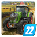
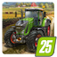
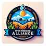

# Hi 👋, I'm a game content creator for Farming Simulator and other games
Currently, I do mostly mods, extensions, tools and assets for Farming Simulator.

## Projects (mods, tools and assets)
Using the links below you can get more information about the mods/tools/assets I have created. In each repo you can report bugs and suggest improvements for that project. 

_**Note:** not all my mods have a dedicated page, check the ["Other mods"](https://github.com/w33zl/FS25_WeezlModding) link for any non-listed mod you are looking for._

### FS25 Projects
|       |  |  |  |
|-------|--|--|--|
| [PowerTools](https://github.com/w33zl/FS25_PowerTools) | [Enhanced Shop Sorting](https://github.com/w33zl/FS25_EnhancedShopSorting) | [Store Search](https://github.com/w33zl/FS25_ShopSearch) | Buy Used Equipment |
| [Developer PowerTools](https://github.com/w33zl/FS25_DevTools) |  |  | [DataDump](https://github.com/w33zl/FS25_DataDump) |
| AdditionalFilltypes | WeezlsModLib | BoostrapMod | [Other Mods](https://github.com/w33zl/FS25_WeezlModding) |

> _**Note:** Refillable IBC Tank, Portable Service Kit etc is found in the [Other Mods](https://github.com/w33zl/FS25_WeezlModding) section_

### Tools and Assets
| Giants Editor Tools  | Blender Assets | Tools & Scripts | 
|-------------------|--|--|
| [GE Hotkeys and Macros](https://github.com/w33zl/GE-Hotkeys-and-Macros) | [Blender Assets](https://github.com/w33zl/Blender_Assets) | [Script Binding Converter](https://github.com/w33zl/FS25-Script-Binding-Converter) |  |
| [GE Toolbox](https://github.com/w33zl/GE-Toolbox) |  |  |  |
| [GE Object Distributor](https://github.com/w33zl/GE-Object-Distributor) |  |  |  |
| [GE TipsAndTrix](https://github.com/w33zl/GE-TipsAndTrix) |  |  |  |

### FS22 Projects
|       |  |  |  |
|-------|--|--|--|
| [PowerTools](https://github.com/w33zl/FS22_PowerTools) | [TidyShop](https://github.com/w33zl/TidyShop) | [CustomTrafficSystem](https://github.com/w33zl/FS22_CustomTrafficSystem) | WeatherEvents |
| [PowerTools Developer](https://github.com/w33zl/FS22_DevTools) | TidyShop ModTitles | Refillable IBC Tank | [SeasonalPrices](https://github.com/w33zl/SeasonalPrices) |
| [DataDump](https://github.com/w33zl/FS22_DataDump) | - | [SmartControl](https://github.com/w33zl/SmartControl) | [Other Mods](https://github.com/w33zl/Other-Mods) |

## Download my mods
To download my mods, please visit my FS19, FS22 or FS25 page on the official Giants ModHub page:

## Open Modding Alliance
I'm a contributor and co-founder of the [Open Modding Alliance](https://github.com/open-modding-alliance) (OMA). The core of OMA is collaboration and knowledge sharing for the greater good of the Farming Simulator community. If you are a modder or create assets for FS I can recommend paying this page a visit:

## Connect with me
📫 Want to get in touch? If you have bugs to report or want to suggest improvements, it is easiest to send a ticket here on GitHub (see projects above). Otherwise you can find me on Facebook, Patreon and Discord:

 *&nbsp;*  *&nbsp;* 

## Like the work I do?
I love to hear you feedback so please check out my [Facebook](https://www.facebook.com/w33zl). If you want to support me you can become my [Patron](https://www.patreon.com/wzlmodding) or buy me a [Ko-fi](https://ko-fi.com/w33zl) :heart:

 

> _By interacting with me and supporting me on these platforms, you help me stay motivated to create new mods and make the publicly available. Any monetary support also helps me towards my dream; to spend more time on making mods for Farming Simulator instead of my current day job (as everyone else, I need to finance my IRL life some way or other)._

## Some of the Languages and Tools I Like to Work With:

  
  
  
  
  
  
  
  
  
  
  
  
  
  
  
  
  
  
  
  
  

###

  
  
  

###
